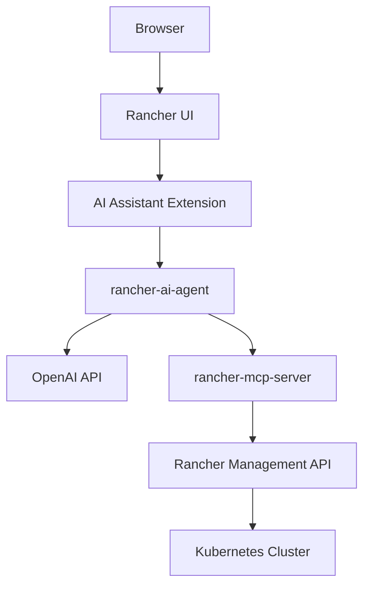
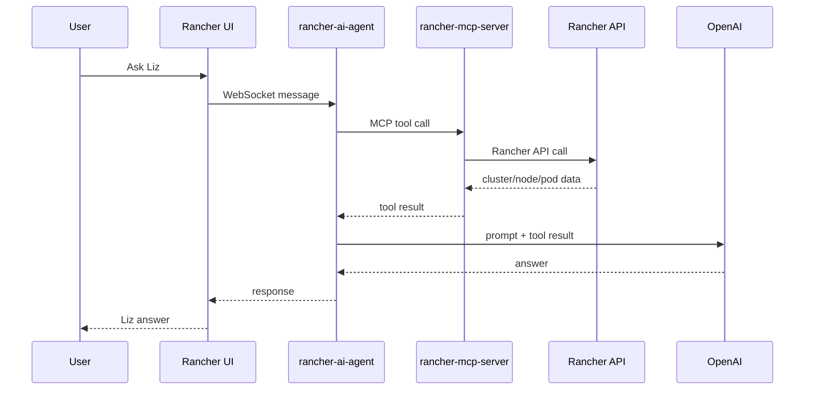

# 02. アーキテクチャ

## 全体構成

```mermaid
flowchart TD
    B[Browser] --> RUI[Rancher UI]
    RUI --> EXT[AI Assistant Extension]
    EXT --> AGENT[rancher-ai-agent]
    AGENT --> OPENAI[OpenAI API]
    AGENT --> MCP[rancher-mcp-server]
    MCP --> RAPI[Rancher Management API]
    RAPI --> K8S[Kubernetes Cluster]
```

## 通信経路

```mermaid
sequenceDiagram
    participant User
    participant UI as Rancher UI
    participant Agent as rancher-ai-agent
    participant MCP as rancher-mcp-server
    participant Rancher as Rancher API
    participant LLM as OpenAI

    User->>UI: Ask Liz
    UI->>Agent: WebSocket message
    Agent->>MCP: MCP tool call
    MCP->>Rancher: Rancher API call
    Rancher-->>MCP: cluster/node/pod data
    MCP-->>Agent: tool result
    Agent->>LLM: prompt + tool result
    LLM-->>Agent: answer
    Agent-->>UI: response
    UI-->>User: Liz answer
```

## ローカル検証の罠

`rancher.localhost` はブラウザには便利ですが、Pod内では `127.0.0.1` と解決されることがあります。

そのため、AI Agent / MCP Server から Rancher API へ到達できない場合があります。
